# CHURN PREDICTION PROJECT - MACHINE LEARNING!

# Project Overview

SyriaTel Communications is a Telecommunications company that is looking to predict and prevent customer churn. Customer churn is when a customer leaves/discontinues their service with SyriaTel. Customer churn is a major problem for many service-based companies because it is so expensive. Not only does the company lose the customer's monthly/yearly payment, but they also incur a customer acquisition cost to replace that customer. The project aims to analyze a telecommunications dataset to predict customer churn. The dataset contains information about customers' demographics, calling behavior, and service plans. The goal is to develop a predictive model that can accurately identify customers who are likely to churn, enabling the company to take proactive measures to retain them

# Business Problem
The telecommunications company is facing a significant issue of customer churn, where customers are discontinuing their services. This poses a threat to the company's revenue and market share. To address this problem, the company wants to leverage the available customer data and build a predictive model that can identify customers at a high risk of churn. By identifying these customers in advance, the company can implement targeted retention strategies to improve customer satisfaction and reduce churn rates.

# Data Used

The scope of this project involved analyzing the churn in telecoms dataset, which is available in the data folder and can be accessed on Kaggle (https://www.kaggle.com/datasets/becksddf/churn-in-telecoms-dataset). The dataset consisted of 21 columns and a total of 3333 unique values. It was already preprocessed and considered relatively clean, without significant outliers or missing values.

# Deliverables

The project's final outcomes will consist of a predictive model specifically designed for customer churn prediction. Additionally, a comprehensive presentation will be prepared, highlighting the key discoveries made throughout the analysis and offering actionable recommendations for the company based on these findings.

## The flow of the notebook is as follows:

1. Loading and Previewing the dataset at hand
1. Data understanding and cleaning
2. Exploratory Data Analysis
3. Preprocessing
5. Modelling
6. Feature importance
7. Findings and Reccomendations
8. Conclusion

## Churn imbalance
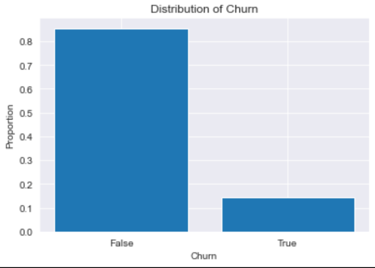
From the visuals and percentages above, There is definitely imbalance. It shall be sorted out in the modelling phase.

## Distribution of continuous variables
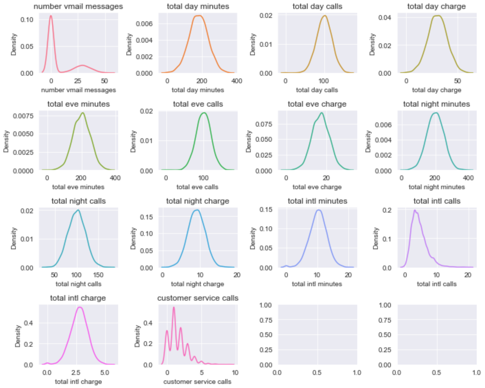

## Distribution of continuous variables
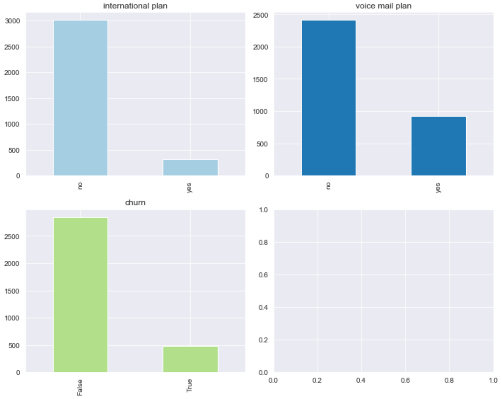

# Exploratory Data Analysis(EDA)

## Churn rate distribution
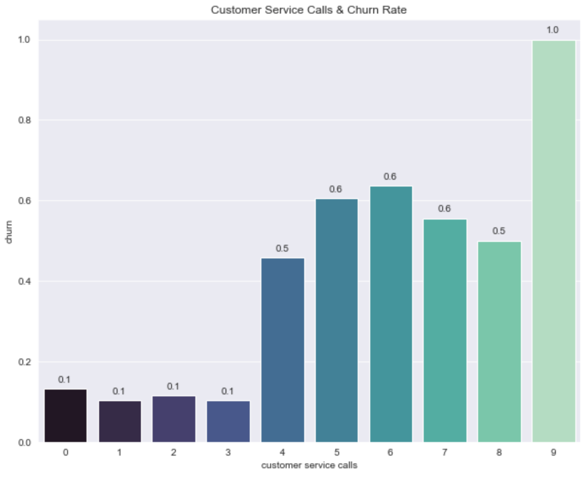

## Area code analysis
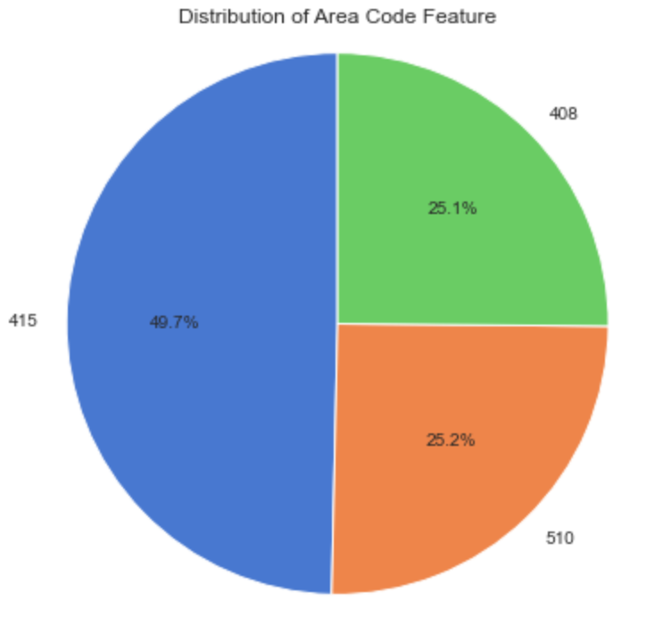
This shows that most clients in the included dataset come from Area code 415, with a percentage of 49.7. One fourth of customers have the area code 510 and another fourth have the area code 408.

## Correlation of continuous variables
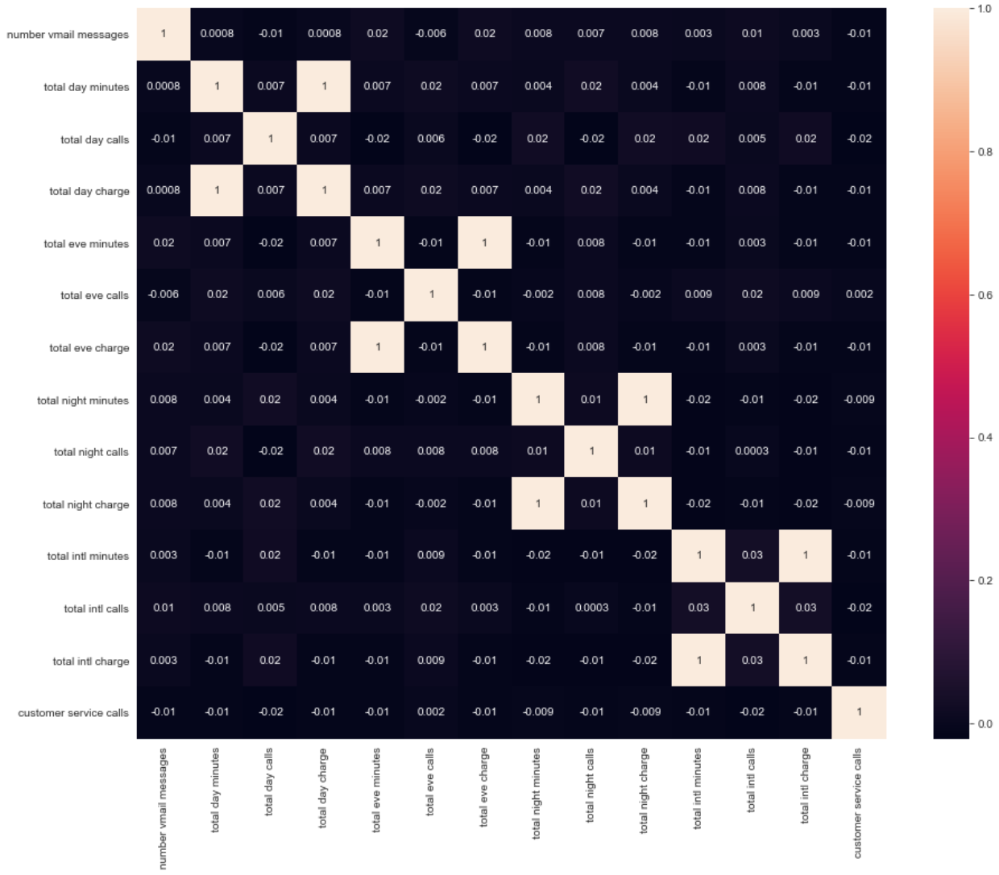
Most of the features are not correlated however some do share a perfect correlation.
Total day charge and total day minutes features are fully positively correlated.
Total eve charge and total eve minutes features are fully positively correlated.
Total night charge and total night minutes features are fully positively correlated.
Total int charge and total int minutes features are fully positively correlated.
It makes sense for these features to be perfectly correlated because the charge is a direct result of the minutes used.
The perfect correlation of 1 indicates the presence of perfect multicollinearity. It does not have the same impact on nonlinear models as it does on linear models. Some nonlinear models are impacted by perfect multicollinearity whereas others are not.

## Confusion Matrices
1. Logistic Regression
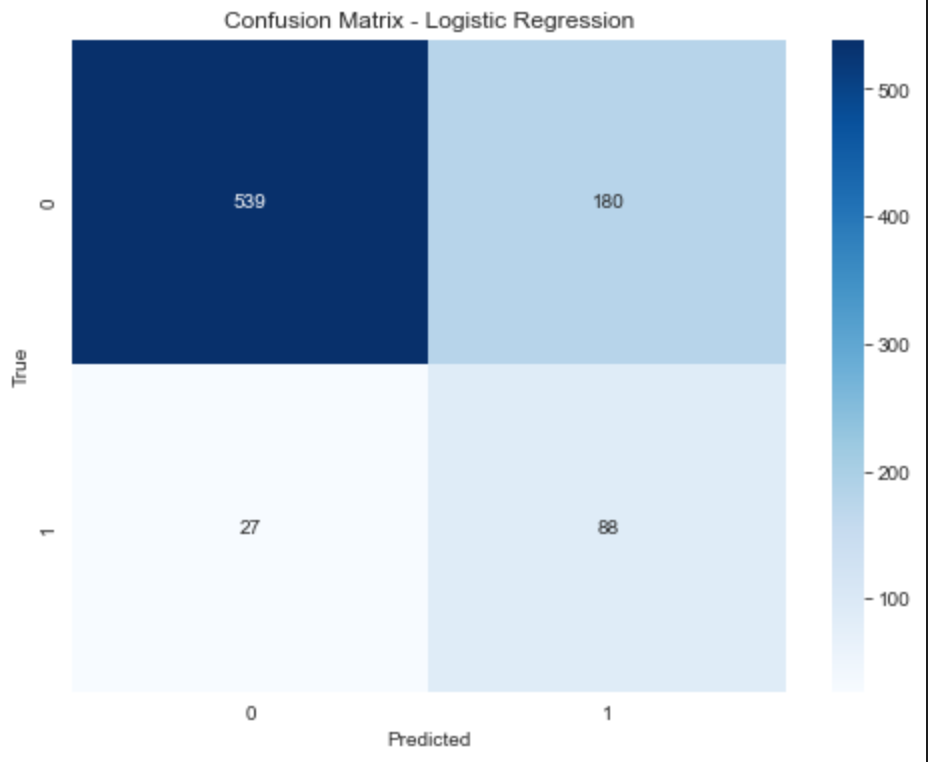

2. Decision Trees
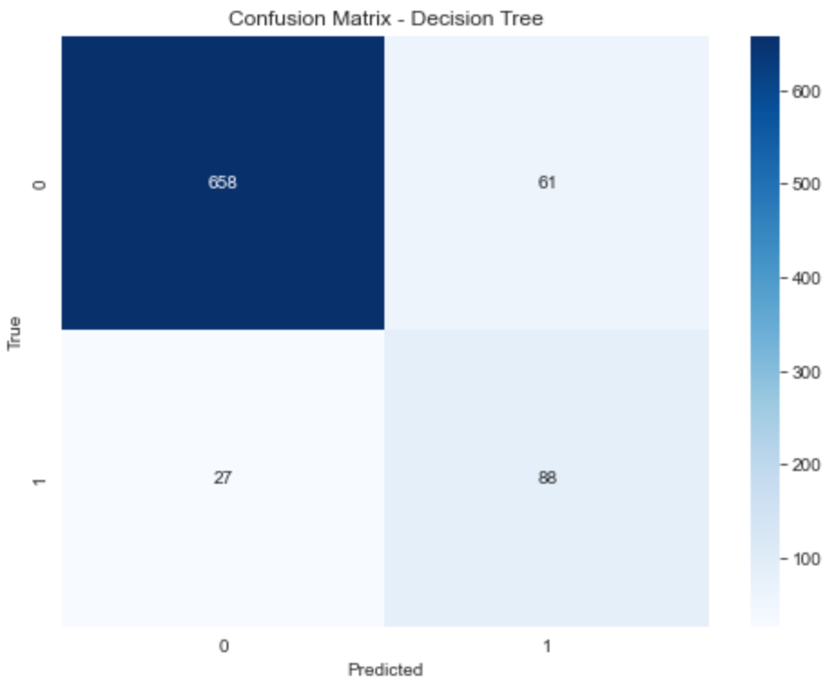

3. Random Forest
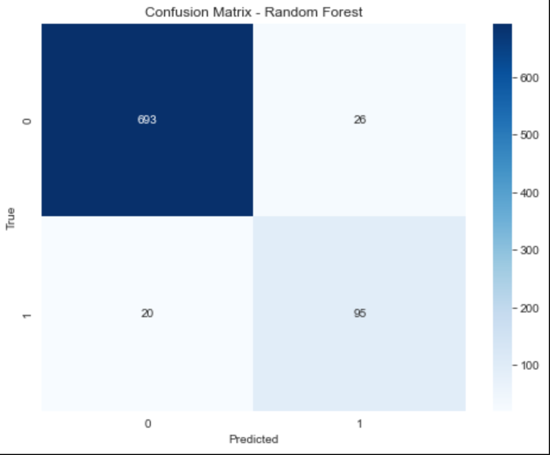

# Evaluation

## Plotting ROC to compare the three models
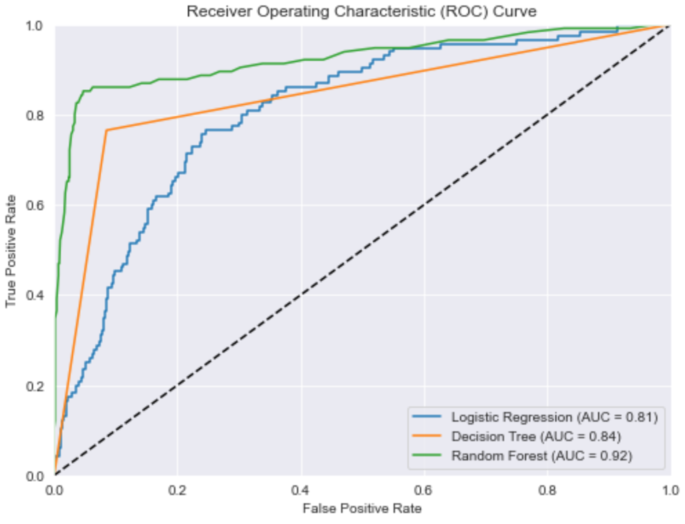
the ROC curve plots the true positive rate (sensitivity) against the false positive rate (1-specificity) of a classifier. A classifier with excellent performance will exhibit a curve that closely follows the upper-left corner of the graph. In the case of the random forest classifier, it often demonstrates this favorable behavior.

## Feature Importance (Top 5 features)
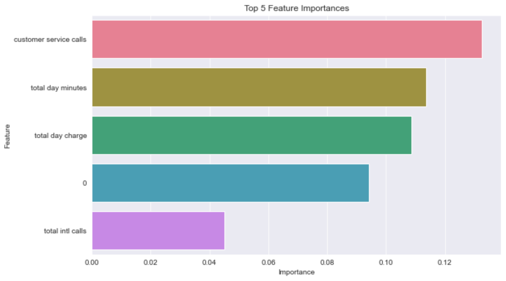

## Findings and Reccomendations
Based on the feature importance plot, it has been determined that customer service calls, total day charge, and total day minutes are the most influential factors contributing to customer churn. This indicates that the telecommunication company should prioritize efforts to enhance customer satisfaction through improved customer service experiences, enhancements in service offerings, and the implementation of strategies to reduce day-time charges.

Furthermore, it is crucial for the telco to monitor and analyze the number of customer service calls, as a high volume of such calls can be indicative of customer dissatisfaction. This information can be leveraged to design targeted retention and engagement programs that aim to mitigate churn and enhance overall customer satisfaction.

By focusing on these insights and taking proactive measures, the telecommunication company can strategically address the identified pain points, thereby reducing customer churn, improving customer retention, and fostering higher levels of customer satisfaction.

## Conclusion

The analysis of customer churn offers valuable insights to the telecom company, providing actionable strategies to mitigate churn effectively. By implementing the recommended approaches, the company can enhance customer retention rates, leading to improved financial performance. However, it is important to note that further research and analysis are necessary to enhance the accuracy of the predictive model and fine-tune the recommendations for even better outcomes.

## Next Steps

1. Occasional re-evaluation and checking of the models performance
2. Gather more data in states with high churn rate
3. Considering feedback and insights from domain experts, stakeholders, or end-users of the model
4. Gather more data on cell signals both locally and international calls
5. Audit customer service department
